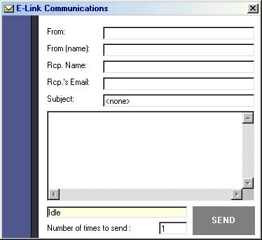



## Simultaneous Emails

### Description

It's a mail sender which DOESN'T NEED A SMTP SERVER! Also, you can specify how many times you want to send the mail, workin as a spammer for 'some' ppl. Most of the code was adopted from Bryan Cairns's 'Send mail without server', most credits given to him. BUT i really improved the GUI.

Pls............vote for it and leave comments. Pls.
 
### More Info
 

             |
---                |---
**Submitted On**   |2001-11-28 23:13:22
**By**             |[su\_su\_u](https://github.com/Planet-Source-Code/PSCIndex/blob/master/ByAuthor/su-su-u.md)
**Level**          |Intermediate
**User Rating**    |4.3 (26 globes from 6 users)
**Compatibility**  |VB 5\.0, VB 6\.0
**Category**       |[Complete Applications](https://github.com/Planet-Source-Code/PSCIndex/blob/master/ByCategory/complete-applications__1-27.md)
**World**          |[Visual Basic](https://github.com/Planet-Source-Code/PSCIndex/blob/master/ByWorld/visual-basic.md)
**Archive File**   |[Simultaneo3806211282001\.zip](https://github.com/Planet-Source-Code/su-su-u-simultaneous-emails__1-29281/archive/master.zip)

